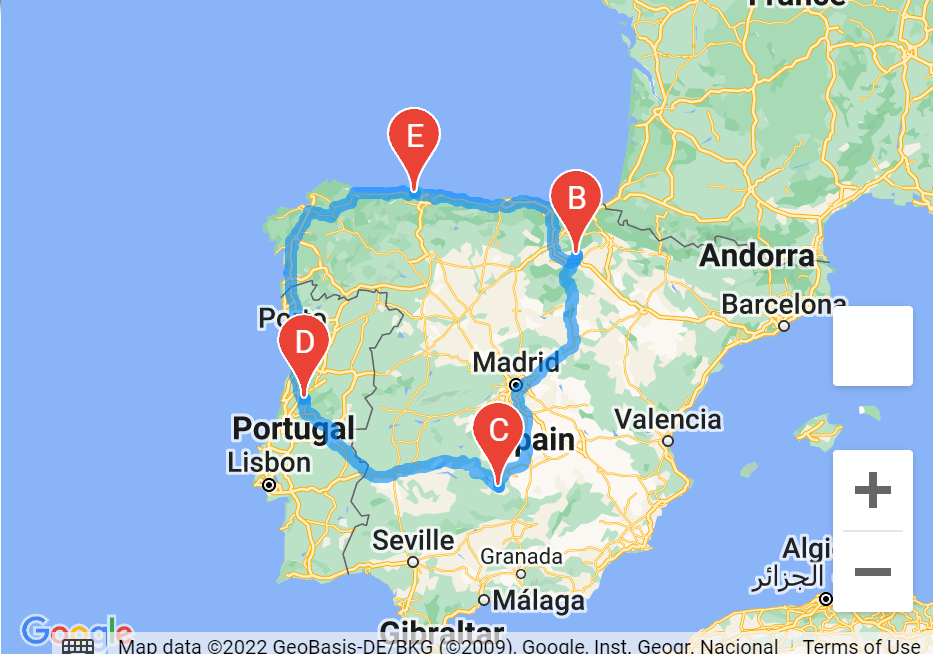
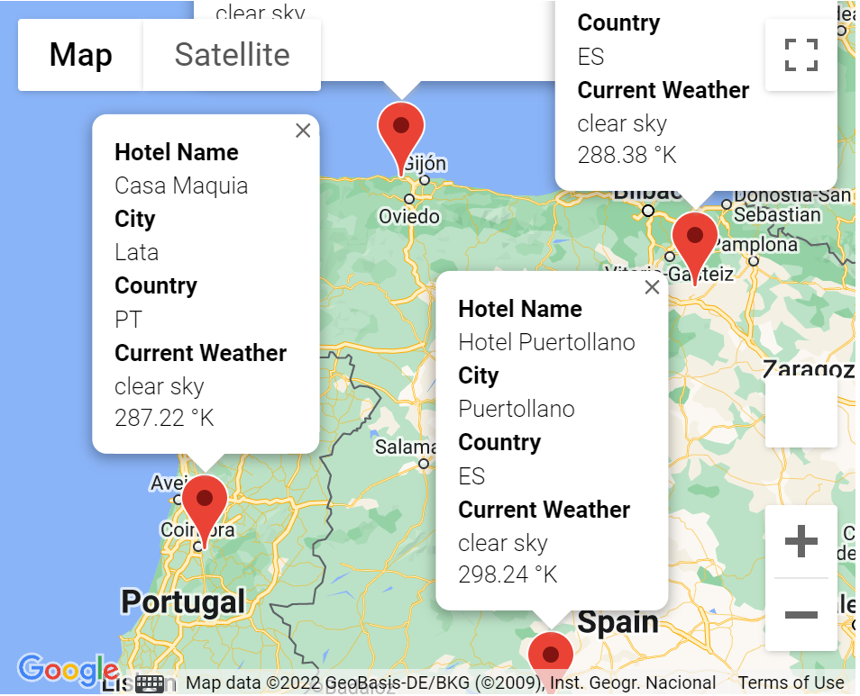

# World_Weather_Analysis

# Overview
In this analysis we utilize API to store a large number of various desirable locations in a dataframe and then map each location. Four locations are selected from the dataframe and stored in numpy arrays. We then reshape the tuples for the desired latitudes and longitudes to place in our gmaps directions layer. With a path created for the round trip starting in Avilés and ending in Avilés, there is certainly a long journey ahead.

To find all relevant information on each city, an info box template is contructed for formatting in dataframe iteration. We then store the results in the hotel info variable as well as the latitudes and longitudes in the locations variable. Both of these variables are placed in the gmaps marker layer for creating a map with the desired info on our locations. 

